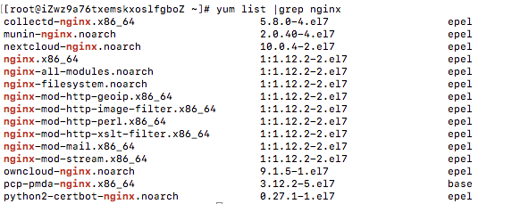

# Nginx在CentOS 7.3的安装与配置

## 升级 CentOS 的 yum

```
yum -y update
```

## 用yum安装必要程序

```
yum -y install gcc gcc-c++ autoconf pcre-devel make automake
yum -y install wget httpd-tools vim
```

<!-- more -->

## Nginx版本说明

- Mainline version ：开发版,主要是给广大Nginx爱好者，测试、研究和学习的，但是不建议使用于生产环境。
- Stable version : 稳定版,也就是我们说的长期更新版本。这种版本一般比较成熟，经过长时间的更新测试，所以这种版本也是主流版本。
- legacy version : 历史版本，如果你需要以前的版本，Nginx也是有提供的。

建议使用最新的Stable version版本。

## 基于Yum的方式安装Nginx

我们可以先来查看一下yum源是中nginx是否已经存在，命令如下：
```
yum list | grep nginx
```

如果出现类似下面的内容，说明yum源是存在的。 




(细心的小伙伴可以发现系统原来的源只支持1.1.12版本，这版本有些低)

如果不存在，或者不是你需要的版本，那我们可以自行配置yum源，下面是官网提供的源，我们可以放心大胆的使用。

```
[nginx]
name=nginx repo
baseurl=http://nginx.org/packages/OS/OSRELEASE/$basearch/
gpgcheck=0
enabled=1
```

复制上面的代码，到以下路径.
```
/etc/yum.repos.d/nginx.repo
```

赋值完成后，你需要修改一下对应的操作系统和版本号，因为我的是centos和7的版本，所以改为这样。
```
baseurl=http://nginx.org/packages/centos/7/$basearch/
```
你可以根据你的系统或需要的版本进行修改。

现在开始安装nginx
```
yum install nginx
```
安装完成后可以使用命令，来检测Nginx的版本。
```
nginx -v
```

# Nginx的配置文件解读

## nginx.conf文件解读

nginx.conf 文件是Nginx总配置文件，在我们搭建服务器时经常调整的文件。
```
/etc/nginx/nginx.conf
```

```
# 运行用户，默认即是nginx，可以不进行设置
user  nginx;

# Nginx进程，一般设置为和CPU核数一样
worker_processes  1;  

# 错误日志存放目录
error_log  /var/log/nginx/error.log warn;

# 进程pid存放位置
pid  /var/run/nginx.pid;

events {
  worker_connections  1024; # 单个后台进程的最大并发数
}

http {
    include  /etc/nginx/mime.types;   # 文件扩展名与类型映射表
    default_type  application/octet-stream;  # 默认文件类型
    # 设置日志模式
    log_format  main  '$remote_addr - $remote_user [$time_local] "$request" '
                      '$status $body_bytes_sent "$http_referer" '
                      '"$http_user_agent" "$http_x_forwarded_for"';

    access_log  /var/log/nginx/access.log  main;   # nginx访问日志存放位置

    sendfile        on;   # 开启高效传输模式
    #tcp_nopush     on;    # 减少网络报文段的数量

    keepalive_timeout  65;  # 保持连接的时间，也叫超时时间

    #gzip  on;  # 开启gzip压缩

    include /etc/nginx/conf.d/*.conf; # 包含的子配置项位置和文件
```

我们看到最后有一个子文件的配置项，那我们打开这个include子文件配置项看一下里边都有些什么内容。

## default.conf 配置项讲解

进入conf.d目录，打开default.conf。
```
server {
    listen       80;   # 配置监听端口
    server_name  localhost;  // 配置域名

    #charset koi8-r;     
    #access_log  /var/log/nginx/host.access.log  main;

    location / {
        root   /usr/share/nginx/html;     #服务默认启动目录
        index  index.html index.htm;    #默认访问文件
    }

    #error_page  404              /404.html;   # 配置404页面

    # redirect server error pages to the static page /50x.html
    #
    error_page   500 502 503 504  /50x.html;   #错误状态码的显示页面，配置后需要重启
    location = /50x.html {
        root   /usr/share/nginx/html;
    }

    # proxy the PHP scripts to Apache listening on 127.0.0.1:80
    #
    #location ~ \.php$ {
    #    proxy_pass   http://127.0.0.1;
    #}

    # pass the PHP scripts to FastCGI server listening on 127.0.0.1:9000
    #
    #location ~ \.php$ {
    #    root           html;
    #    fastcgi_pass   127.0.0.1:9000;
    #    fastcgi_index  index.php;
    #    fastcgi_param  SCRIPT_FILENAME  /scripts$fastcgi_script_name;
    #    include        fastcgi_params;
    #}

    # deny access to .htaccess files, if Apache's document root
    # concurs with nginx's one
    #
    #location ~ /\.ht {
    #    deny  all;
    #}
}
```

明白了这些配置项，我们知道我们的服务目录放在了/usr/share/nginx/html下，可以使用命令进入看一下目录下的文件。

```
cd /usr/share/nginx/html
ls 
```

可以看到目录下面有两个文件，50x.html 和 index.html。我们可以使用vim进行编辑。

可以预想到，我们的nginx服务器已经可以为html提供服务器了。我们可以打开浏览器，访问ip地址试一试。

**配置时可能会遇到的报错：**
> server name "***" has suspicious symbols

**原因**
nginx要求  server_name 不能包含“/”    

错误：server_name http://xxx.com;

正确：server_name xxx.com;

当然一般情况下我们都只有IP比如10.10.69.10。那么直接在server_name后填上ip就行

一般：server_name 10.10.69.10;

[本文引用来自 技术胖http://jspang.com/posts/2018/10/05/nginx.html](http://jspang.com/posts/2018/10/05/nginx.html)
