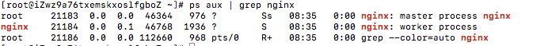

# Nginx服务启动、停止、重启

## 启动Nginx服务
在CentOS7.3版本里（低版本是不行的），是可以直接直接使用nginx启动服务的。
```
nginx
```

<!-- more -->

## 使用systemctl命令启动

还可以使用个Linux的命令进行启动，我一般都是采用这种方法进行使用。因为这种方法无论启动什么服务，都是一样的，只是换一下服务的名字（不用增加额外的记忆点）。
```
systemctl start nginx.service
```

输入命令后，没有任何提示，我们如何知道Nginx服务已经启动了？可以使用Linux的组合命令，进行查询服务的运行状况。
```
ps aux | grep nginx
```

如果启动成功会出现如下图片中类似的结果。




有这三条记录，说明我们Nginx被正常开启了。

## 停止Nginx服务的四种方法

停止Nginx 方法有很多种，可以根据需求采用不一样的方法，我们一个一个说明。

- 立即停止服务
```
nginx -s stop
```
这种方法比较强硬，无论进程是否在工作，都直接停止进程。

- 从容停止服务
```
nginx -s quit
```
这种方法较stop相比就比较温和一些了，需要进程完成当前工作后再停止。

- killall 方法杀死进程
```
killall nginx
```
这种方法也是比较野蛮的，我们直接杀死进程，但是在上面使用没有效果时，我们用这种方法还是比较好的。

- systemctl 停止
```
systemctl stop nginx.service
```

## 重启Nginx服务

有时候我们需要重启Nginx服务，这时候可以使用下面的命令。
```
systemctl restart nginx.service
```

## 重新载入配置文件

在重新编写或者修改Nginx的配置文件后，都需要作一下重新载入，这时候可以用Nginx给的命令。
```
nginx -s reload
```

## 查看端口号

在默认情况下，Nginx启动后会监听80端口，从而提供HTTP访问，如果80端口已经被占用则会启动失败。可以使用命令以下查看端口号的占用情况。
```
netstat -tlnp
```

# Nginx在windows中启动关闭重启等基本操作

1. 进入到nginx.exe所在的目录
2. 然后在nginx根目录下运行 start nginx

### 在根目录下的操作:

- 检查配置文件的有效性
```
nginx -t 
```
- 立即关闭
```
nginx -s stop
```
- 处理完当前的请求后关闭
```
nginx -s quit	
```
- 修改完配置文件后重新加载
```
nginx -s reload	
```
- 打开日志文件
```
nginx -s reopen	
```

[本文引用来自 技术胖http://jspang.com/posts/2018/10/05/nginx.html](http://jspang.com/posts/2018/10/05/nginx.html)
