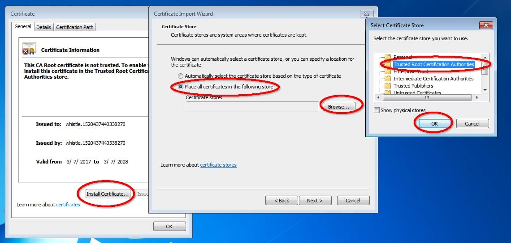

[whistle](https://github.com/avwo/whistle)是基于Node实现的跨平台web调试代理工具，类似的工具有Windows平台上的[Fiddler](http://www.telerik.com/fiddler/)，主要用于查看、修改HTTP、HTTPS、Websocket的请求、响应，也可以作为HTTP代理服务器使用，不同于Fiddler通过断点修改请求响应的方式，whistle采用的是类似配置系统hosts的方式，一切操作都可以通过配置实现，支持域名、路径、正则表达式、通配符、通配路径等多种[匹配方式](http://wproxy.org/whistle/pattern.html)，且可以通过Node模块[扩展功能](http://wproxy.org/whistle/plugins.html)。


<!-- more -->


### 安装whistle

执行如下npm命令安装whistle （**Mac或Linux的非root用户需要在命令行前面加`sudo`，如：`sudo npm install -g whistle`**）

```sh
npm install -g whistle
```

npm默认镜像是在国外，有时候安装速度很慢或者出现安装不了的情况，如果无法安装或者安装很慢，可以使用taobao的镜像安装：

```sh
npm install cnpm -g --registry=https://registry.npm.taobao.org
cnpm install -g whistle

# 或者直接指定镜像安装：
npm install whistle -g --registry=https://registry.npm.taobao.org
```

whistle安装完成后，执行命令 `whistle help` 或 `w2 help`，可以查看whistle的帮助信息。如果能正常输出whistle的帮助信息，表示whistle已安装成功。


### 启动whistle

> whistle支持三种等价的命令`whistle`、`w2`、`wproxy`

启动whistle:

```sh
w2 start
```

重启whsitle:

```sh
w2 restart
```

停止whistle:

```sh
w2 stop
```

调试模式启动whistle(主要用于查看whistle的异常及插件开发):

```sh
w2 run
```

启动完whistle后，就需要配置代理。


### 配置代理

配置信息

1.  代理服务器：127.0.0.1 (如果部署在远程服务器或虚拟机上，改成对应服务器或虚拟机的ip即可)

2.  默认端口：8899 (如果端口被占用，可以在启动时通过 `-p` 来指定新的端口)

   

浏览器代理：安装浏览器代理插件 

安装Chrome代理插件：推荐安装`SwitchyOmega`，然后进行SwitchyOmega的设置





### 访问配置页面

启动whistle及配置完代理后，访问配置页面，如果能正常打开页面，whistle安装启动完毕，可以开始使用。

可以通过以下三种方式来访问配置页面：

- 方式1：域名访问 `http://local.whistlejs.com/`
- 方式2：通过ip+端口来访问，形式如 `http://whistleServerIP:whistlePort/` e.g. `http://127.0.0.1:8899`
- 方式3：通过命令行参数 `-P xxxx` 自定义webui的端口(`xxxx`表示要设置的端口号)，自定义端口支持上述两种方式访问，也支持 `http://127.0.0.1:xxxx`


###  配置https

现在很多应用都 https 化了，如果要调试这些应用，免不了就要对 https 的资源进行处理。而在上面也提到了，Whistle 是利用[『中间人攻击』](https://zh.wikipedia.org/wiki/%E4%B8%AD%E9%97%B4%E4%BA%BA%E6%94%BB%E5%87%BB)的原理来抓 https的报文的。所以，这里我们需要来信任下我们的中间人（Whistle）的根证书。

根证书在哪儿呢？在刚才打开的配置页面顶部，有个 HTTPS 按钮，点一下，会出来弹出框。




点击 "Download RootCA" 下载，下载完点击安装rootCA.crt文件。

- Windows

  

  

  双击证书，根据指引安装证书。证书安装过程，要确保证书存储到`受信任的根证书颁发机构`下。


##### 开启拦截HTTPS




1.`Capture HTTPS CONNECTs`：开启Https拦截功能，只有勾上这个checkbox及装好根证书，whistle才能看到HTTPS、Websocket的请求

1. 也可以通过配置来开启对部分请求的Https拦截功能

   ```plain
   www.test.com enable://intercept
   /alibaba-inc/ enable://intercept
   ```

   > 也可以用过 enable://capture

2. 如果想过滤部分请求不启用Https拦截功能

   ```plain
   # 指定域名
   www.baidu.com  disable://intercept
   
   # 通过正则
   /baidu/ disable://intercept
   ```


### whistle常用配置




whistle的Rules配置页面有一个默认分组`Default`，用户也可以通过上面的菜单栏按钮`Create`、`Edit`、`Delete`分别创建、重命名、删除自定义分组，whistle先在选中的用户自定义分组中从上到下依次匹配，然后再到`Default`中匹配(如果`Default`分组被启用的情况下)。


1. host映射和特定子路径的host映射，whistle不仅支持传统的host配置，还支持端口的host转发配置

   ```
   # 直接的host配置
   127.0.0.1:8080 www.qq.com
   
   # 对多个域名路径替换host
   127.0.0.1:8080 www.qq.com ke.qq.com
   
   # 将指定的路径映射到指定ip和端口
   127.0.0.1:8080 www.qq.com/a/b/c
   ```

   

2. 替换线上文件，把响应替换成本地文件内容。协议头可以加也可以不加，不加表示匹配所有协议，否则只对指定协议生效

   ```
   # Mac、Linux
   www.ifeng.com file:///User/username/test/index.html
   www.ifeng.com/cdn/example.js file:///User/username/test/example.js
   
   # Windows的路径分隔符可以用 \ 或者 /
   www.ifeng.com file://E:\xx\test\index.html
   www.ifeng.com/cdn/example.js file://E:\xx\test\example.js
   ```

   

3. 替换请求，请求转发（将指定域名请求转发到另一个域名）

   ```
   # 替换请求url，我们可以在whistle的Network右侧里看到真是请求的url
   http://qq.com/a/b?c=d http://qq.com/v/w?x=y&z=z
   
   # 请求转发
   www.qq.com www.jd.com
   
   # 所有qq.com子域名转发
   **.qq.com www.jd.com
   ```

   **注意：**替换请求规则的修改在浏览器的 network 里体现不出来，因为请求已经发出去，是到 whistle 层才被修改的，我们可以在whistle的Network右侧里看到真实请求的url

   

4. 重定向

   ```
   # 重定向
   https://www.baidu.com/ redirect://https://www.qq.com/
   ```

   

5. 页面中注入html、js、css

   whistle会自动根据响应内容的类型，判断是否注入相应的文本及如何注入(是否要用标签包裹起来)。

   ```
   # Mac、Linux
   www.ifeng.com html:///User/xxx/test/test.html
   www.ifeng.com js:///User/xxx/test/test.js
   www.ifeng.com css:///User/xxx/test/test.css
   
   # Windows的路径分隔符可以用`\`和`/`
   www.ifeng.com html://E:\xx\test\test.html
   www.ifeng.com js://E:\xx\test\test.js
   www.ifeng.com css://E:\xx\test\test.css
   
   # 也可以插入在主菜单"Value"中定义的文件，如插入js文件。
   # 本文之后提到的所有注入，whistle都支持这两种方式的导入形式
   www.ifeng.com js://{test.js}
   ```

   所有www.ifeng.com域名下的请求，whistle都会根据响应类型，将本地文件注入到对应类型的响应文件内容里面（对应类型的响应文件如果有多个，则会重复添加），如是html请求，js和css会分别自动加上`script`和`style`标签后追加到内容后面。

   

6. 修改返回码

   ```
   # 使 http 返回 404
   www.qq.com statusCode://404
   ```

   

7. Mock 数据

   日常开发中，我们经常需要对后端接口进行 Mock，这样就不需要依赖后端部署了，或者我们需要测试一些边缘情况，Mock 这些边缘情况就可以免除为测试这样的边缘链路做许多麻烦事。最简单的 Mock 可以针对一个 pattern 替换响应体和响应码等等。

   ```
   # 将 example.com/api/user 接口的响应内容替换为 user.json 中的内容，并将响应码替换成 200
   # 其中，user.json 在 Values 面板中保存
   example.com/api/user resBody://{user.json} replaceStatus://200
   
   # 当然，也可以使用本地文件
   example.com/api/user resBody://E:\xx\test\user.json
   ```

   我们甚至可以设定请求的响应延时，只需要再加一个 `resDelay` 的 operatorURI：

   ```
   # 10s 后返回
   example.com/api/user resBody://{user.json} replaceStatus://200 resDelay://10000
   ```

   可能有时候会有更加复杂的 Mock 需求，比如几个接口之间互相有关联，需要跑通一个完整的链路可能需要一些定制的逻辑。Whistle 提供了很多插件，其中有一个能够提供非常强大 Mock 能力的插件——[whistle.vase](https://link.zhihu.com/?target=https%3A//github.com/whistle-plugins/whistle.vase)。使用这个插件，我们甚至可以直接写 JS 代码，根据我们的具体请求参数作出各种具体逻辑。

   ```text
   npm i -g whistle.vase
   ```

   在安装完之后，就可以在 Plugins 中对其进行配置了。


> 文章引用：
>
> https://wproxy.org/whistle/
>
> https://zhuanlan.zhihu.com/p/47029559
>
> https://zhuanlan.zhihu.com/p/79037633
>
> https://juejin.im/post/5bfaaa1be51d454c4d63bcda
>
> https://aotu.io/notes/2017/08/29/an-introduction-to-whistle/index.html
>
> https://imweb.io/topic/596480af33d7f9a94951744c