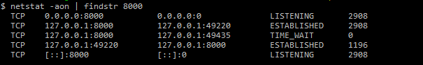
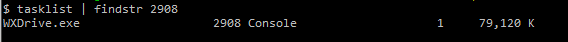

# 在windows上查看端口占用的进程

根据端口号查看进程号，例如查看8000端口
```
netstat -aon | findstr 8000
```




再根据进程号查看进程
```
tasklist | findstr 2908
```




在任务管理器中就可以找到该进程

# 在linux服务器上查看端口占用的进程

根据端口号查看进程号，例如查看4873端口
```
sudo lsof -i :4873
```

杀死指定进程
```
sudo kill -9 {PID}
```

服务器中使用 pm2 启动 verdaccio 守护进程
```
sudo pm2 start `which verdaccio`

```
